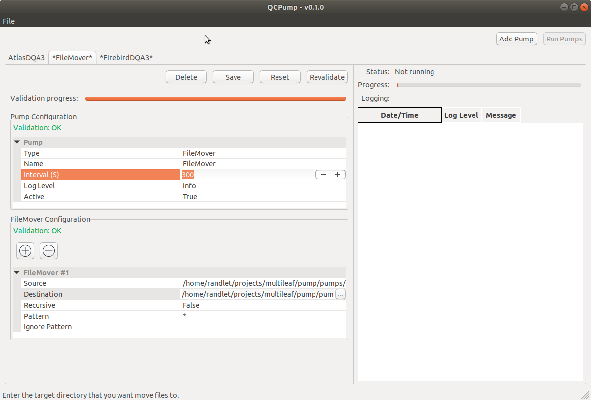

Welcome to QCPump's documentation!
==================================

.. toctree::
   :maxdepth: 2
   :caption: Contents:

   release_notes.rst
   install.rst
   settings.rst
   operate.rst
   pumps/index.rst
   pumps/dev/developing.rst

QC Pump Overview
----------------

    QCPump Interface

QCPump is an extensible utility for extracting data from various sources
(databases, filesystem etc) and moving it to other locations.  

QCPump allows you to define one or more *Pumps* of various types (known as *Pump Types*
e.g. :ref:`File Mover <pump_type-filemovers>` and :ref:`Firebird DQA3
<pump_type-dqa3-fbd>`) to retrieve data from databases, filesystems, and other
data sources.  Typically these *Pumps* run at regular interval to look for new
data, and when that data is present they extract it, potentially transform it
in some way, and then upload it to QATrack+, move it somewhere else on disk,
leave it alone, or take some other action. 

QCPump currently includes the following Pump Types:

    * :ref:`Simple File Mover & File Mover <pump_type-filemovers>` which
      serve as examples for writing your pump types.

    * :ref:`FirebirdDQA3 & AtlasDQA3 <pump_type-filemovers>` which can be used
      for retrieving Daily QA3 data from Firebird & Atlas (SQLServer)
      databases.

QC Pump was built primarily as a tool for uploading data to QATrack+, but there
is nothing preventing you from using it for other tasks you want to perform
periodically.  For example, you could :ref:`write a Pump Type of your own
<pumps-developing>` that ran once a day to generate a backup file of a
database.  If you think your *Pump Type* would be valuable to others please
contribute it back to QCPump!

QC Pump License
...............

QC Pump is licensed under the `MIT License
<https://github.com/qatrackplus/qcpump/blob/master/LICENSE>`_ and all code
contributed to the QCPump project will fall under the same license.

Indices and tables
==================

* :ref:`genindex`
* :ref:`modindex`
* :ref:`search`
