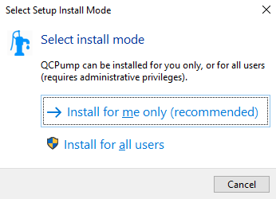
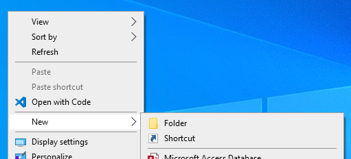
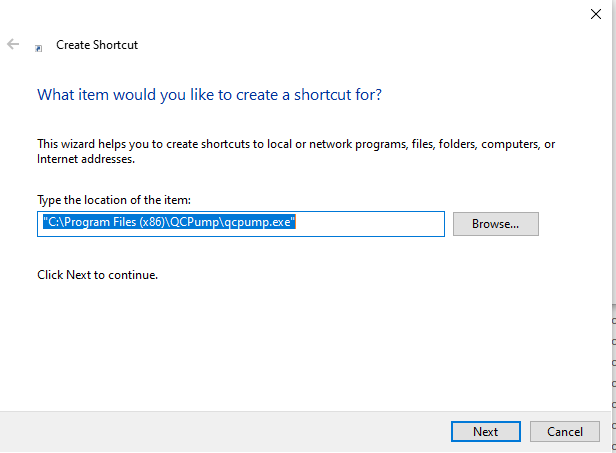
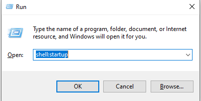
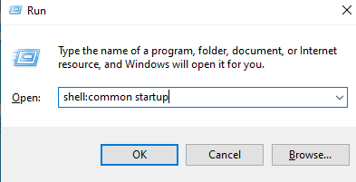
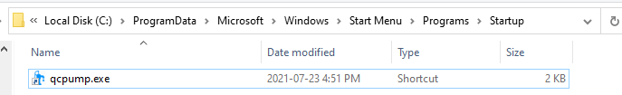
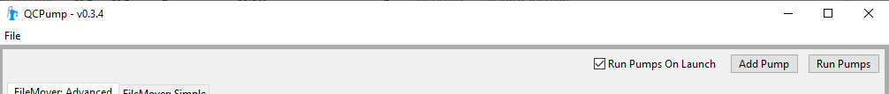

.. _install:

Installing QCPump
-----------------

.. _install-win-installer:

Installing with the Windows Installer
.....................................

On Windows platforms please download the `QCPump Installer
<https://github.com/qatrackplus/qcpump/raw/master/installer/qcpump-setup-0.3.14.exe>`_.
Download and run the installer following the prompts.  You may choose to
install for the current user only, or all users on this system.  

    QCPump: Choose whether to install for all users or just the current user.

Installing for All Users requires administrator privileges while installing for
only the current user should be possible regardless of user type.  Please note
that either way you install, the pump configuration will be shared across all
users regardless of whether you install for the current user or all users.

After Installing
................

Now that QCPump is installed, go to the :ref:`pumps-configure-new` page to
start configuring some *Pumps*.  After that you may want to see the following
section on starting QCPump automatically.

Starting QCPump Automatically
.............................

If you want want to have QCPump start up automatically when a user logins you
can do so by adding QCPump your startup folder.  

First create a shortcut to QCPump on the desktop by right clicking on the desktop and
selecting "New -> Shortcut":

    QCPump: Create a desktop shortcut for QCPump

and select the QCPump application (usually located at
`C:\\Users\\YOURUSERNAME\\AppData\\Local\\Programs\\QCPump\\qcpump.exe` if you
installed for a single user, or `C:\\Program Files (x86)\\QCPump\\qcpump.exe`
if you installed for all users).

    Select the QCPump application to link to

and then finish the dialog.

Next we need to move the shortcut to the appropriate startup folder.

To startup for just the current user open the Run dialog (Win Key + R), type
`shell:startup` and click OK.

    Open Startup folder

Or to startup for all users open the Run dialog (Win Key + R), type
`shell:common startup` and click OK.

    Open Common Startup folder

Now drag and drop the desktop link into the startup folder:

    Startup Shortcut

Finally launch QCPump and ensure that "Run Pumps On Launch" is checked.

    Tell QCPump to automatically start running pumps on launch

.. _install-source:

Obtaining and running from source
.................................

.. note::

    You will need both Python (version 3.7-3.9) and Git installed on 
    your computer to run QCPump from source.

In order to obtain the source code for QCPump install Git and then clone the
QCPump repository:

.. code:: bash

    git clone https://github.com/qatrackplus/qcpump.git

If you are on Windows, visit https://www.lfd.uci.edu/~gohlke/pythonlibs/ and
download DukPy for your particular version of Python.  Now create a new venv to
install the QCPump requirements:

.. code:: bash

    cd qcpump

    # create your venv
    python -m venv env

    # activate venv on Windows and install requirements
    env\Scripts\Activate.ps1
    pip install C:\path\to\dukpy-0.2.3-cp39-cp39-win_amd64.whl
    pip install -r requirements\base.txt

    # activate venv on *nix
    source env/bin/activate
    # replace 18.04 with your Ubuntu version 
    pip install -U -f https://extras.wxpython.org/wxPython4/extras/linux/gtk3/ubuntu-18.04 wxPython
    pip install -r requirements/base.txt

and then to run the program:

.. code:: bash

    python launch_qcpump.py

Now you can proceed to the :ref:`pumps-configure-new` page to start configuring
some *Pumps*.

