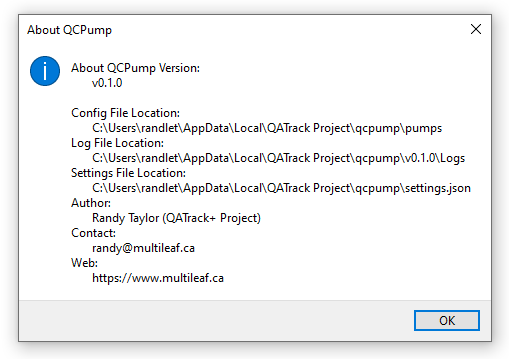

.. _operate:

Operating QCPump
================

Running your Pumps
------------------

After you've configured and :ref:`saved at least one Pump <pumps-save>` you can
run all active pumps bu clicking the `Run Pumps` toggle button at the top of the
QCPump window.  

Stopping your Pumps
--------------------

At any time you may stop the current pumps by clicking the `Stop Pumps` toggle
button at the top of the QCPump window.  

Log Files, Config Files, and Settings Files
-------------------------------------------

In order to see where QCPump is storing your log files, config files and QCPump
setting files use the `About` menu option in the `File` menu:

    QCPump About Page

Each *Pump* you configure will have its own configuration directory which
contains a `config.json` JSON document that represents the current
configuration of your *Pump*.

Each pump will have its own log file placed in the main QCPump log directory.
These log files can provide important information when trying to debug any
issues you are having with QCPump.

QCPump Settings
...............

QCPump has a limited set of settings you can configure by editing the
settings.json JSON document found in the QCPump config directory. Settings
available are:

DEBUG
    Useful for developers only. Set to `"DEBUG": true` to prevent redirecting
    stderr/stdout to file. 

LOG_LEVEL
    Controls the logging level for the QCPump application itself (not the pumps
    which have their own log level settings). Set to `"LOG_LEVEL": "debug"` to
    get more detailed log info. Other options include `info, warning, error,
    critical`.

DB_CONNECTION_TIMEOUT
    Timeout for database connections where available.  Default value is 3s.

PUMP_DIRECTORIES
    A list of directories to look for :ref:`custom Pump Types
    <pumps-developing>` you are using.

A sample settings.json document might look like:

.. code:: json

    {
        "LOG_LEVEL": "info",
        "DEBUG": False,
        "PUMP_DIRECTORIES": ["C:\Users\yourusername\pumps\"],
        "DB_CONNECT_TIMEOUT": 3,
    }
