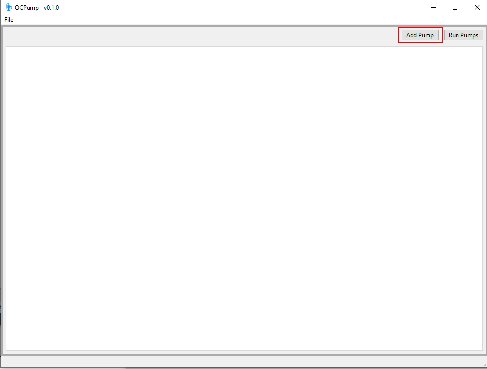
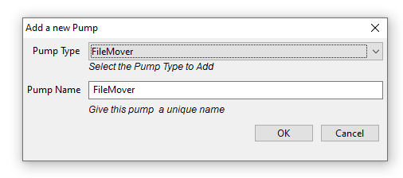
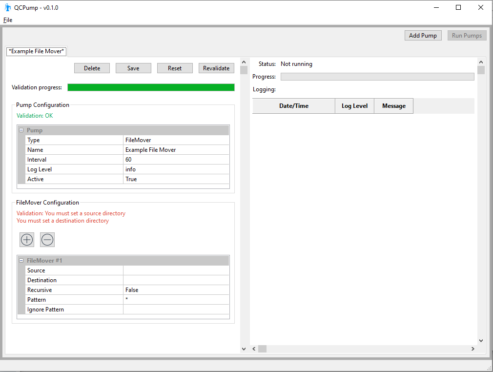
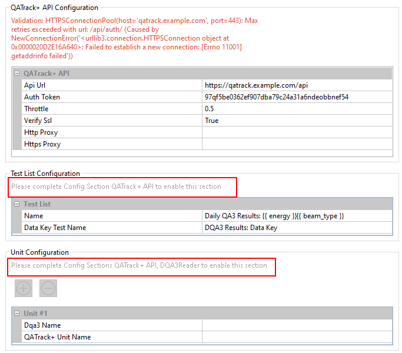
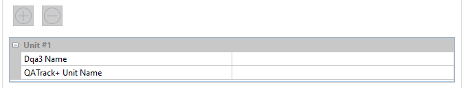

.. _pumps-configure-new:

Configuring New Pumps
=====================

When you first launch QCPump you will be met with a more or less blank slate.

    QCPump with no pumps installed

Click the *Add Pump* button at the top right. Select the *Pump Type* you want
to create, give the *Pump* a meaningful name and click *OK*.

    QCPump with no pumps installed

After adding you click *OK* you will see a tab for your new *Pump* displayed:

    A new pump added

On the left of the tab are the configuration options for the pump and on the
right is a logging window which is used to display messages from your pump.

The configuration panel is separated into different configuration sections.
All pumps have a common set of configuration options included under the *Pump
Configuration* heading which control things like whether this pump is active
and how often the pump should run.

.. _pumps-common-config:

Common Pump Configuration Options
---------------------------------

Every *Pump* you configure has the following options available in the *Pump
Configuration* section:

Type
    Displays the *Pump Type* of the current *Pump* (not editable)

Name
    Displays the name of the current *Pump* (not editable)

Interval (s)
    How often the pump should run in seconds.

Log Level
    A dropdown allowing you set the verbosity of logging for this Pump.  Set to *debug* to
    get the maximum level of verbosity.  Logging messages will be shown both in the
    status panel as well as written to log files.  The location of the log files can 
    be seen by accessing the *About* menu option in the *File* menu.

Active
    Select whether this pump will be activated when you click the *Run Pumps* button.

*Pump Type* specific options are covered in their own pages:

.. toctree::
    :maxdepth: 2
    :caption: Pump Type Specific Options:

    filemover.rst
    dqa3.rst
    mpc.rst

Configuration Validation
........................

Any time you edit a configuration value your *Pump* will be re-validated.  This
may include actions such as ensuring a file system directory exists, or sending
an HTTP request to check that a QATrack+ API endpoint is reachable.  

.. note::

    Currently the *Pump* tab is disabled during validation to prevent multiple
    validations from running simultaneously.

After validation, a message will be shown indicating whether each configuration
setting is valid or not. 

You can force a revalidation (say if some external factor was reconfigured /
updated) by pressing the `Revalidate` button.

Configuration Dependencies
..........................

Some *Pump Types* will have configuration sections which depend on other
configuration sections being validated successfully before they can be
completed.  For example, selecting a Unit configured in QATrack+ will not be 
possible until QCPump has verified it can talk to your QATrack+ API. 

When a dependency of a configuration section has not been met, the dependent
section will be disabled and a message will be shown to inform you of which
sections need to be completed before the dependent section can be verified.

    QCPump config with unmet dependencies

Multiple Configuration Subsections
..................................

Some configuration sections allow you to use multiple repeated subsections.  An
example of this would be the configuration used by the DQA3 Pump Types to map
DQA3 Machines to QATrack+ Units:

    Multiple config subsections

To add new configuration subsections click the *+* button, and to remove a
subsection, highlight one of its configuration options and click the *-*.

.. _pumps-save:

Saving your Pumps
-----------------

Before you can run your pumps, they all must be saved (pumps which haven't been
saved will be marked with asterisks surrounding their pump tabs name). Once you
have configured and validated your *Pump* click the `Save` button at the top of
its config section. The location of the configuration files for QCPump can 
be found by accessing the *About* menu option in the *File* menu.

Reseting a Configuration
------------------------

If you want to reset your Pump config, click the `Reset` button at the top of
its config.  This will reset the pumps config to the most recently saved
version of the pumps configuration.

Deleting a Pump
---------------

If you want to delete a Pump config, click the `Delete` button at the top of
its config.  This will permanently delete this pump and remove its
configuration file from disk.

