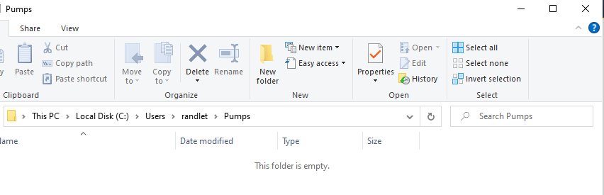
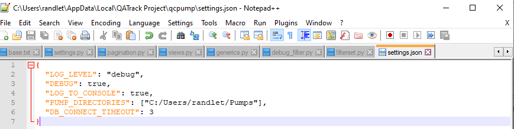
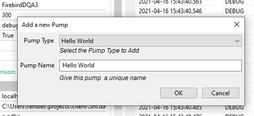
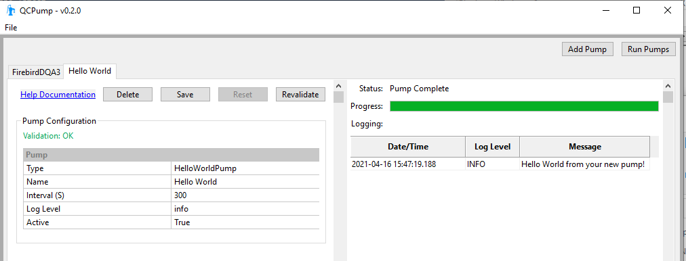
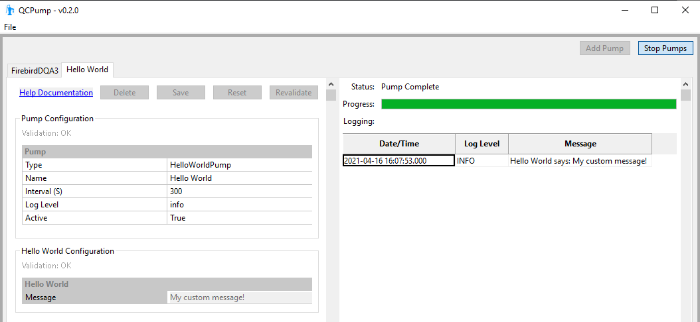
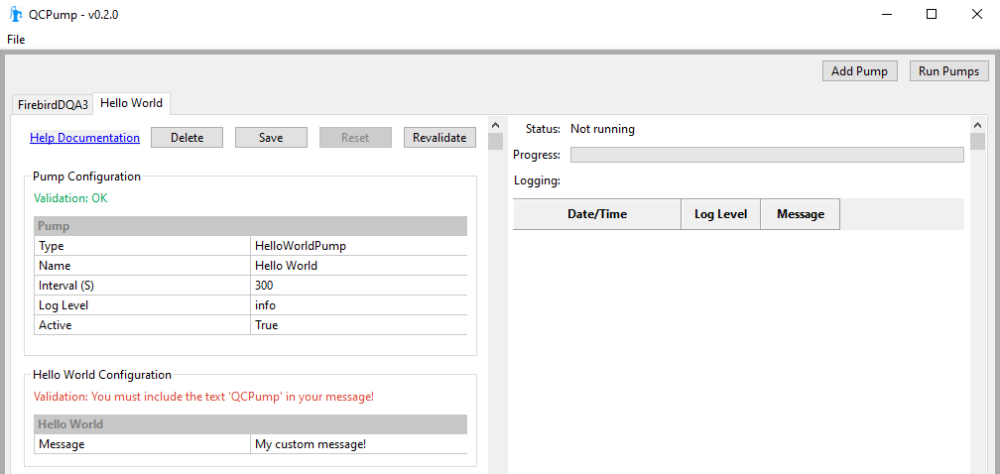
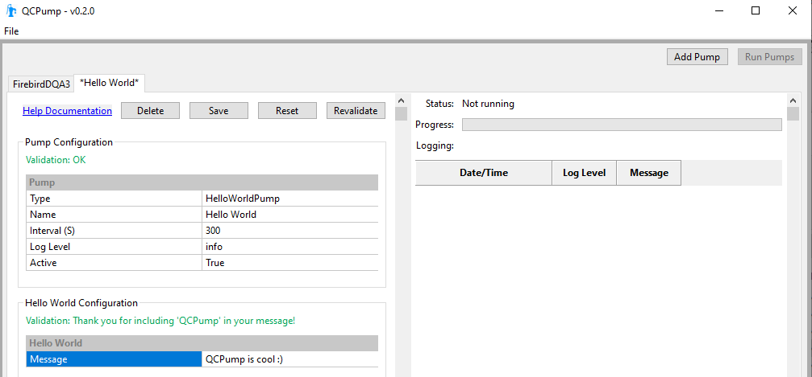

.. _pumps-developing:

Preparation
===========

Install QCPump
--------------

Follow the :ref:`installation instructions <install>` and either install the
precompiled executable version of QCPump using the Windows installer, or
install QCPump from source

Create a PumpType directory
---------------------------

Create a directory somewhere to contain your pump types.  I am going to use a
directory in my home directory called `Pumps`:

Now, find your QCPump config file location file by launching QCPump and going
to File->About:

.. figure:: images/config_file_loc.png

Navigate to that directory and edit the settings.json file (you can just use
notepad.exe or whatever your favourite editor is):

.. figure:: images/config_file.png

adding your new PumpType directory to the `PUMP_DIRECTORIES` list (use forward
slashes `/` instead of back slashes `\\` !):

Developing your own Pump Types
==============================

To create your own PumpType you will need to create a subclass of
`qcpump.pumps.base.BasePump` and, at a minimum, implement a `pump` method.

First create a subdirectory in your pumps subdirectory called `HelloWorld` and
in that directory create a file called `hello_world.py` with the following
content:

.. code:: python

    from qcpump.pumps.base import BasePump

    class HelloWorldPump(BasePump):

        DISPLAY_NAME = "Hello World"

        def pump(self):
            self.log_info("Hello World from your new pump!")

This is the simplest possible pump; all it does is log a debug message every
time QCPump calls its `pump` method.

Now launch QCPump and click add a new Hello World pump:

On the `Hello World` pump page, click `Save` then `Run Pumps` (note if you have
other pumps configured you may want to deactivate them first!).  You should
see a message logged to the status pane of your Hellow World pump:

That's it! You've just written your first Pump Type. It doesn't do much, but should get you
started on your journey.

Adding Configuration Options To Your Pump
=========================================

Let's extend our Hello World Pump to log a message that can be customized by
our users.

Modify your hello_world.py file so it has the following code:

.. code:: python

    from qcpump.pumps.base import BasePump, STRING

    class HelloWorldPump(BasePump):

        DISPLAY_NAME = "Hello World"

        CONFIG = [
            {
                'name': 'Hello World',
                'fields': [
                    {
                        'name': 'message',
                        'type': STRING,
                        'required': True,
                        'help': "Enter the message you want to see logged",
                        'default': "A default message",
                    },
                ],
            },
        ]

        def pump(self):
            message = self.get_config_value("Hello World", "message")
            self.log_info(f"Hello World says: {message}")

By adding the `CONFIG` option, we are telling QCPump we want our users to be
able to configure an option called `message` in a configuration section called
`Hello World` that will have a string type (see :ref:`dev-config` for more
option types).  If you relaunch QCPump, you should now see your new
configuration option.  Change the default message, click `Save`, and run the
pump again and you should see it log your new custom message:

Adding Validation To Your Pump
==============================

QCPump allows you to do some data validation to ensure things are configured
correctly. Modify your hello_world.py to add a validation method for our
message option:

.. code:: python

    from qcpump.pumps.base import BasePump, STRING

    class HelloWorldPump(BasePump):

        DISPLAY_NAME = "Hello World"

        CONFIG = [
            {
                'name': 'Hello World',
                'validation': 'validate_message',
                'fields': [
                    {
                        'name': 'message',
                        'type': STRING,
                        'required': True,
                        'help': "Enter the message you want to see logged",
                        'default': "A default message",
                    },
                ],
            },
        ]

        def pump(self):
            message = self.get_config_value("Hello World", "message")
            self.log_info(f"Hello World says: {message}")

        def validate_message(self, values):
            message = values['message']

            if "QCPump" not in message:
                valid = False
                message = "You must include the text 'QCPump' in your message!"
            else:
                valid = True
                message = "Thank you for including 'QCPump' in your message!"

            return valid, message

Here we have added a `validate_message` method that ensures our users have the
text 'QCPump' in their message.  The `values` variable is a dictionary with
keys made up by the names of our configuration options from this section, and
values made up of the current value the user has configured.  Since our `Hello
World` configuration section only has a single option, `values` is just a
dictionary with a single key:

.. code:: python

    values == {
        'message': "Some configured message",
    }

Validation methods must return an iterable of length two (e.g. a two tuple, or
a list of two items) where the first item is True/False representing whether
the configuration section is valid or not, and the second item is a string
validation message which will be displayed to the user.

If you launch QCPump again and enter a value without the string 'QCPump' you
should see your Pump will be marked as invalid:

Adding the text 'QCPump' will validate the pump:

For more information on writing QCPumps please see the information below.

.. _dev-config:

Config Options
==============

Option Types
------------

You can add options of type:

STRING
    Short free form text
BOOLEAN
    A True/False drop down
INT
    An integer value
UINT = 'uint'
    A unsigned/positive integer value
FLOAT
    A decimal (floating point) value
MULTCHOICE
    A dropdown to select one option
DIRECTORY
    A path to a directory

Setting choices for Multiple Choice options
-------------------------------------------

.. todo::  Choices Docs

.. _dev-validation:

Validation
----------

.. todo:: Validation docs

.. _dev-dependencies:

Dependencies
============

.. todo::  Dependency Docs

QATrack+ Mixins
===============

QATrackAPIMixin
---------------

.. todo:: QATrackAPIMixin docs

QATrackFetchAndPost
-------------------

.. todo:: QATrackFetchAndPost docs

QATrackFetchAndPostTextFile
---------------------------

.. todo:: QATrackFetchAndPostTextFile docs

QATrackFetchAndPostBinarFile
----------------------------

.. todo:: QATrackFetchAndPostBinaryFile docs
