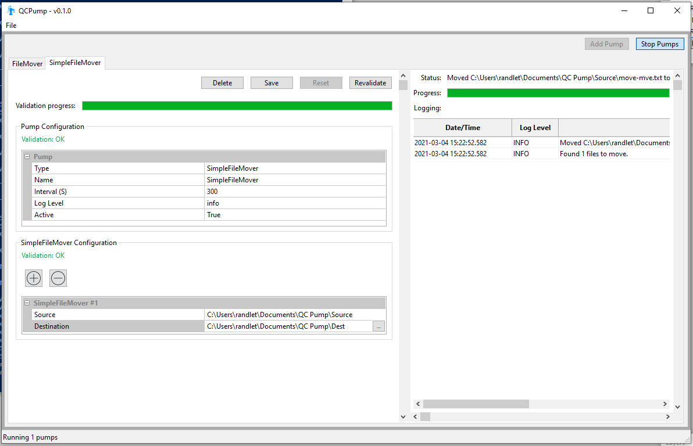
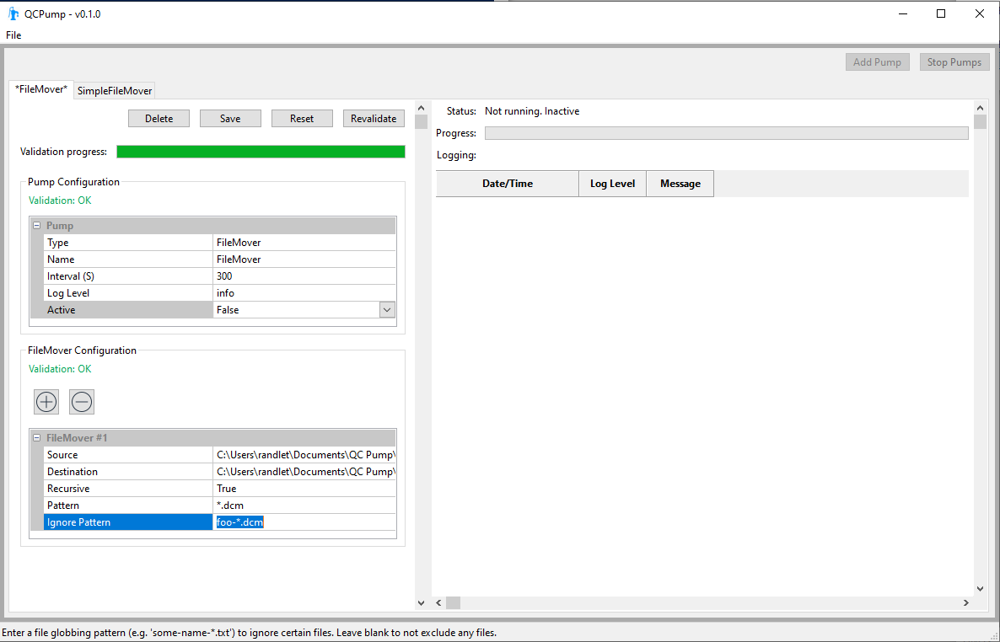

.. _pump_type-filemovers:

FileMover Pumps
===============

The two FileMover pumps are primarily meant to serve as simple 
examples of how to write your own pump types.  There is both a
:ref:`Simple File Mover <pump_type-simplefilemover>` which simply
moves all files from one directory to another, and a slightly more
complex :ref:`File Mover <pump_type-filemover>` which allows you to
filter based on file patterns, and iterate through subdirectories.

.. _pump_type-simplefilemover:

Simple File Mover
-----------------

The `Simple File Mover` *Pump* is a very simple pump that simply moves files
from one or more source directories to one or more destination directories
periodically.  It will not recurse through subdirectories

.. warning::

   Files in your Destination directory may be overwritten by new files if they
   have the same name!

Configuration options
.....................

Define one or more file movers using these options:

Source
    The directory to move files from

Destination:
    The directory to move files to

Mode:
    Choose whether files should be moved, or copied

    QCPump Simple File Mover

.. _pump_type-filemover:

File Mover
----------

The `File Mover` *Pump* is a pump that moves files from one or more source
directories to one or more destination directories periodically.  This pump
differs from the  `Simple File Mover` by adding options allowing you to perform
`glob` file matching and filtering, as well as optionally recursing through
subdirectories.

.. warning::

   Files in your Destination directory may be overwritten by new files if they
   have the same name!

Configuration options
.....................

Define one or more file movers using these options:

Source
    The directory to move files from

Destination
    The directory to move files to

Mode:
    Choose whether files should be moved, or copied

Recursive
    Set to `True` to have the file mover look through all subdirectories of the
    `Source` directory.

Pattern
    Set to a `Glob style pattern <https://en.wikipedia.org/wiki/Glob_%28programming%29>`_ to
    specify what files to include. Only files with a matching filename will be moved.

Ignore Pattern
    Set to a `Glob style pattern
    <https://en.wikipedia.org/wiki/Glob_%28programming%29>`_ to specify what
    files to exclude from the matched files. The `Ignore Pattern` is applied
    after the matching by `Pattern` is done and therefor acts as a filter on
    matched files. For example to move all .dcm files *except* for those that
    start with `foo-` set `Pattern = *.dcm` and `Ignore Pattern = foo-`.

    QCPump File Mover

