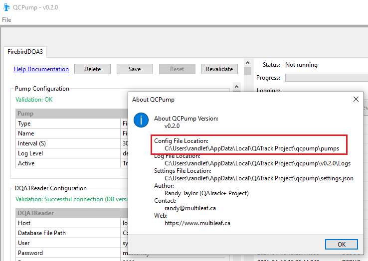
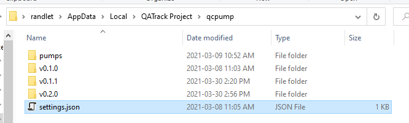

.. _qcpump-settings:

QCPump Settings
===============

You can find the location of your QCPump settings file location file by
launching QCPump and going to File->About:

You can edit the settings.json file with any text editor:

Available Settings
------------------

You may add one or more of the following settings to the settings.json file
to override the default values:

BROWSER_USER_AGENT (string)
    The User-Agent to use when making outgoing web requests. (Default
    "Mozilla/5.0 (Windows NT 10.0; Win64; x64) AppleWebKit/537.36 (KHTML, like
    Gecko) Chrome/70.0.3538.102 Safari/537.36 Edge/18.19582")

DB_CONNECT_TIMEOUT (integer)
    Timeout in seconds for database connections where available. (Default 30)

DEBUG (`true`, `false`)
    Currently only used to redirect std input / output. Must be set to `true`
    if you want to use an interactive debugger while developing QCPump.
    (Default: `false`)

LOG_LEVEL (`debug, info, warning, error, critical`)
    Choose the QCPump application logging level (individual pumps are not
    affected by this).  One of.
    (Default: `info`)

LOG_TO_CONSOLE (`true`, `false`):
    Should logs be written to console as well as log files?

PUMP_DIRECTORIES (list of file paths or null)
    Set to list of other directories to include user defined pump types from.
    See :ref:`pumps-developing`.

.. _qcpump-settings-startup:

PUMP_ON_STARTUP (`true`, `false`)
    Should QCPump immediately start pumping when it is launched.  This is useful
    for e.g. adding QCPump to a startup folder so it launches when a machine is rebooted
    and starts pumping immediately. (Default `false`)
